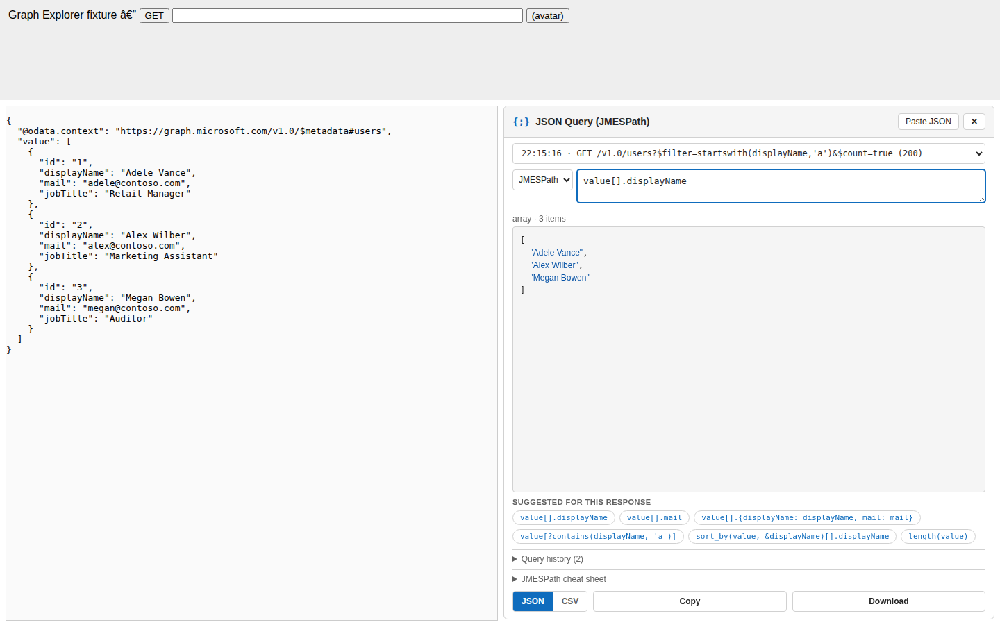

# Graph Explorer JSON Query

A browser extension for **Chrome** and **Microsoft Edge** that adds JSON query
capabilities to [Microsoft Graph Explorer](https://developer.microsoft.com/en-us/graph/graph-explorer).
Run a Graph query, then filter, reshape, sort, and export the JSON response
with [JMESPath](https://jmespath.org/) — the same query language as Azure CLI's
`--query` option — or with [JSONPath](https://github.com/JSONPath-Plus/JSONPath).



## Features

- **Split results view** — the Graph Explorer results area splits in half:
  the original response stays on the left, and the query tool takes the right,
  with the query input on top and the live result underneath.
- **Two query languages** — JMESPath (default) or JSONPath, switchable from
  the selector next to the query box or from the extension settings.
  - JMESPath: `value[?jobTitle == 'Auditor'].{name: displayName, email: mail}`
  - JSONPath: `$.value[?(@.jobTitle == 'Auditor')].displayName`
- **Advanced Graph queries by default** — GET requests that use `$filter`,
  `$search`, or `$orderby` automatically gain the `ConsistencyLevel: eventual`
  header and `$count=true`, which [Microsoft Graph advanced queries](https://learn.microsoft.com/graph/aad-advanced-queries)
  require. On by default; toggle it in the settings.
- **Automatic sign-in** — opening Graph Explorer while signed out clicks the
  profile view for you to start the sign-in flow (on by default; your browser
  may ask you to allow the sign-in popup).
- **Auto-fetch all pages** *(opt-in)* — follow the `@odata.nextLink` chain and
  add the combined dataset to the response list, so you can query the entire
  result set at once. The page-count and data-size limits are configurable
  (defaults: 50 pages / 10 MB); if a query exceeds them the combined entry is
  marked *incomplete* and the panel shows a warning. The extension replays the
  original request's own headers for the follow-up pages; nothing is stored.
- **Response history** — the last 25 Graph responses are kept (in memory
  only); pick any of them from the dropdown to query it.
- **Query history** — queries you run (Enter, or clicking a suggestion) are
  saved with a timestamp and the Graph request they ran against. The history
  size is configurable in the settings (default 50, or unlimited). Clicking a
  saved query restores it — including its query language — and the **Load ↗**
  button re-populates Graph Explorer's request editor with the saved method
  and URL: in place when the method already matches, otherwise via Graph
  Explorer's own share-link format (`?request=…&method=…&version=…`), the same
  mechanism its built-in history uses.
- **Smart suggestions** — one-click query chips generated from the shape of
  the current response in the selected language, plus a built-in cheat sheet.
- **Export as JSON or CSV** — a format switch in the footer controls both
  **Copy** and **Download** (CSV is available for arrays of objects or
  scalars — great for Excel).
- **Paste JSON** — paste any JSON document to query it, even without running a
  Graph request.
- **Quick access** — double-click the toolbar icon to jump straight to Graph
  Explorer (single click opens the settings popup, where Enter also opens
  Graph Explorer), or press <kbd>Alt</kbd>+<kbd>G</kbd> from anywhere.
- **All Graph clouds** — captures responses from `graph.microsoft.com`,
  US Government and China endpoints, and Graph Explorer's sample-tenant proxy
  used when you're not signed in.
- **Resilient** — if Microsoft ever changes Graph Explorer's page structure,
  the panel automatically falls back to a floating side drawer toggled from the
  bottom-right corner.

## Installation (load unpacked)

The extension is plain JavaScript — no build step.

**Option A — download a build artifact (recommended):**

1. Open the repository's **Actions** tab, pick the latest green **Build** run
   on `main`, and download the `graph-explorer-json-query-v…` artifact.
2. Unzip it somewhere permanent.
3. **Chrome:** open `chrome://extensions` · **Edge:** open `edge://extensions`.
4. Enable **Developer mode** (Chrome: toggle top-right; Edge: toggle in the left sidebar).
5. Click **Load unpacked** and select the unzipped folder (the one containing `manifest.json`).

**Option B — from a clone:** same steps, but select the repository folder
itself as the unpacked extension.

Then open [Graph Explorer](https://developer.microsoft.com/en-us/graph/graph-explorer)
and run any query. Requires Chrome/Edge 111 or newer.

## Usage

1. Run a query in Graph Explorer, e.g. `GET /v1.0/users`.
2. The response area splits and the **JSON Query** panel appears on the right
   (if you hid it, click the **{;} JSON Query** button in the bottom-right corner).
3. Pick a language (JMESPath or JSONPath) and type a query in the top box —
   the result renders below as you type. An empty query shows the whole
   response. Press Enter to save the query into the history.
4. Pick **JSON** or **CSV** in the footer, then **Copy** or **Download**.

### Settings

Click the toolbar icon to open the settings popup:

| Setting | Default | Effect |
| --- | --- | --- |
| Query language | JMESPath | Language used by the query panel (also switchable in the panel) |
| Advanced queries | on | Adds `ConsistencyLevel: eventual` + `$count=true` to `$filter`/`$search`/`$orderby` GET requests |
| Auto sign-in | on | Starts the sign-in flow when you open Graph Explorer signed out |
| Auto-fetch all pages | off | Follows `@odata.nextLink` and adds the combined dataset to the response list |
| Auto-fetch limits | 50 pages / 10 MB | Stops the chain at these limits; the panel warns when a dataset was cut off |
| Query history limit | 50 | How many distinct queries to keep (checkbox for unlimited) |

### Query examples (JMESPath)

| Query | What it does |
| --- | --- |
| `value[].displayName` | Pluck one field from every item |
| `value[?startswith(displayName, 'A')]` | Filter items |
| `value[].{name: displayName, email: mail}` | Reshape into smaller objects |
| `sort_by(value, &displayName)[].displayName` | Sort by a field |
| `length(value)` | Count items |
| `value[?jobTitle == 'Auditor'].mail \| [0]` | Filter, project, take first |
| `"@odata.nextLink"` | Read a key containing special characters |

See the [JMESPath tutorial](https://jmespath.org/tutorial.html) and the
[JSONPath syntax reference](https://github.com/JSONPath-Plus/JSONPath#syntax-through-examples).

## How it works

- `src/interceptor.js` runs in the page's MAIN world at `document_start` and
  wraps `window.fetch`/`XMLHttpRequest`. JSON responses from Microsoft Graph
  endpoints are forwarded to the content script via `window.postMessage`.
  When enabled, it also upgrades advanced queries (header + `$count=true`)
  and follows `@odata.nextLink` pagination.
- `src/content.js` renders the panel inside a ShadowRoot and embeds it into
  Graph Explorer's results area (`#response-area`), splitting it 50/50. A
  `MutationObserver` re-attaches the panel whenever Graph Explorer's React app
  re-renders that area.
- `vendor/jmespath.js` ([jmespath.js](https://github.com/jmespath/jmespath.js)
  0.16.0, MIT) and `vendor/jsonpath-plus.js`
  ([jsonpath-plus](https://github.com/JSONPath-Plus/JSONPath) 10.3.0, MIT)
  evaluate the queries.

### Privacy

Everything runs locally in your browser. The extension makes no network
requests of its own — the only exception is the opt-in auto-fetch feature,
which requests the *next pages of the same Graph query* by replaying that
request's own headers; they are never read, stored, or sent elsewhere.
Captured responses live only in the page's memory (cleared on reload). What is
persisted via `chrome.storage.local`: your settings, your last query text,
panel state, and the query history (query text, language, timestamp, and the
method + URL of the Graph request it ran against — never response data).

## Development

```bash
npm test        # unit tests (node:test, no dependencies)
npm run e2e     # offline end-to-end smoke test (needs Playwright + Chromium)
npm run icons   # regenerate icons/ from scripts/make-icons.js
npm run package # zip the extension into dist/ for store submission
```

The repository root is the extension — edit, then hit **Reload** on the
extensions page to pick up changes.

The e2e test loads the extension into headless Chromium and drives it
against a Graph Explorer stand-in served via Playwright route
interception, so it needs no network. Install Playwright first:
`npm i -D playwright && npx playwright install chromium`.

CI (`.github/workflows/build.yml`) runs both suites on every push and PR
to `main` and uploads a ready-to-load extension artifact.

**Note on non-English locales:** in-place editor population and auto
sign-in locate Graph Explorer controls primarily by their English
aria-labels (with a structural fallback for the request input). On other
locales the Load button falls back to the deep link — which still works —
and auto sign-in may not trigger.

### Repository layout

```
manifest.json          Manifest V3 (Chrome + Edge)
src/interceptor.js     MAIN-world fetch/XHR interceptor + request upgrades
src/content.js         Panel UI (isolated world, ShadowRoot)
src/content.css        Panel styles (light + dark theme)
src/query-utils.js     Pure helpers, shared with unit tests
src/background.js      Service worker (Alt+G command)
vendor/jmespath.js     Vendored JMESPath engine (MIT)
vendor/jsonpath-plus.js Vendored JSONPath engine (MIT)
popup/                 Toolbar popup: instructions + settings
scripts/make-icons.js  Icon generator (no dependencies)
test/                  Unit tests (`node --test`)
```

## Future ideas

- A `jq` engine (needs a WASM build, which is why it isn't bundled yet) — the
  language selector is already in place to accommodate it.
- Saved favorite queries with names.

## License

MIT — see [LICENSE](LICENSE). The vendored `jmespath.js` (© James
Saryerwinnie) and `jsonpath-plus` are MIT licensed.
